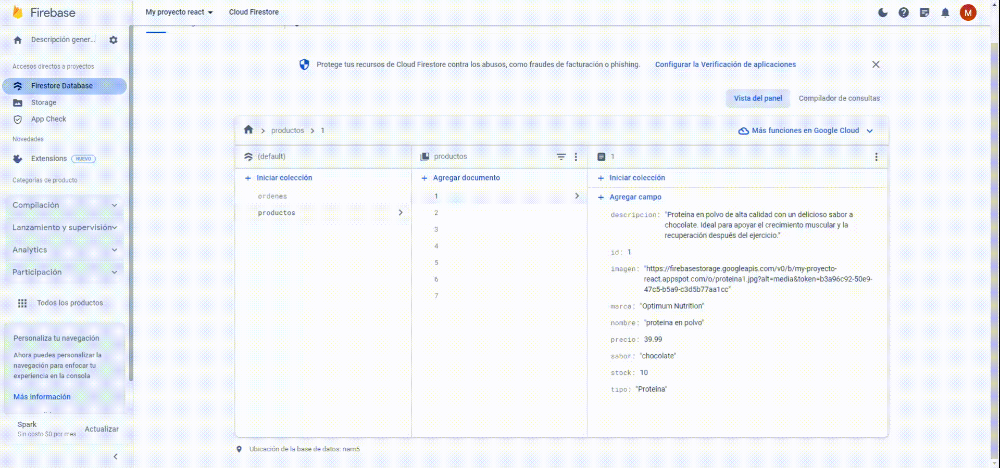

# React Entrega Final Aragona

se realiza un E-COMMERCE de suplementos (PROTEINAS, AMINOACIDOS, CREATINAS)
como se ve en el gif contamos con una barra de navegación donde tenemos el logo del E-commerce que si clickeamos allí nos dirige al HOME donde estan todos los productos disponibles.
Luego, tenemos un menú desplegable por categorias donde ahí eligiendo una de ellas, procedemos a un filtro de solo esa categoría, a su vez filtramos los productos mediante su ID en las cards de los productos. Donde tenemos un "ver mas" que va a estar la info detallada del suplemento con su precio y un botón de "agregar al carrito" (tiene un boton de + y - para agregar más productos,con la lógica de que si no hay mas stock se deshabilita dicha opción de agregar al carrito). En cada seleccion que se haga se muestra un SPINNER por un determinado tiempo para que el usuario sepa que estan cargando los productos.
 A la derecha observamos en el ícono del carrito el número de unidades agregadas (en rojo). Si clickeamos allí nos lleva a ver lo que fue seleccionado para la compra.
Ya dentro del carrito observamos los productos seleccionados con la suma de sus precios y botones de vaciar carrito, eliminar por producto y un botón de ordenar pedido donde implementamos un formulario básico con los datos del usuario donde le generará un número de ID que se agrega en la base de datos con sus datos ingresados.

------------------------------------------------------------------gif del E-COMMERCE-----------------------------------------------------------------------------------

-------------------------------------------------------------------gif del firebase-------------------------------------------------------------------------------------

